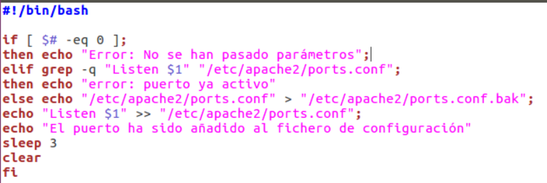
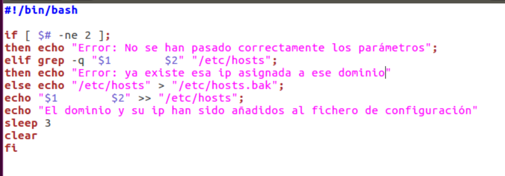
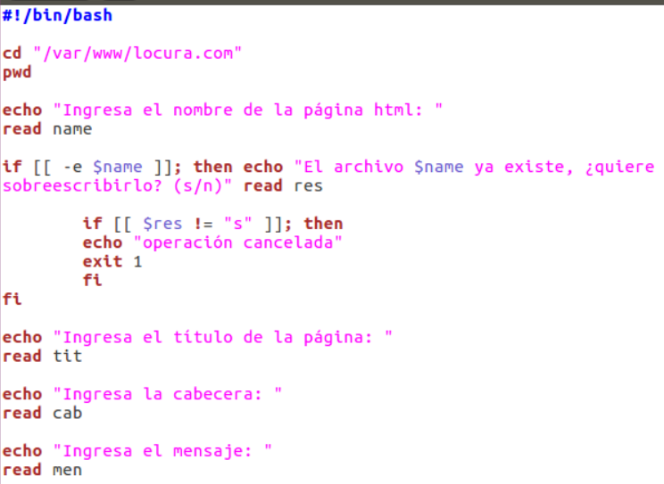
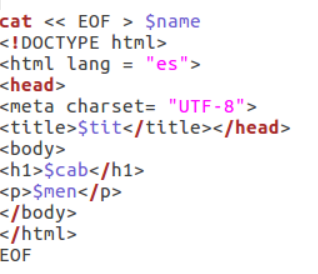

  

# Práctica 1: Tema 1 - Configuración de Apache en Ubuntu

## Ejercicios

Trabajando con scripts (debes publicarlos en GitHub), se te plantea resolver los siguientes problemas:

1. **Añadir un puerto de escucha en la configuración de Apache**

   Crea un script que añada un puerto de escucha en el fichero de configuración de Apache. El puerto se recibirá como parámetro en la llamada. Asegúrate de que el puerto no esté ya presente en el fichero de configuración.

   - Validación de argumentos.
   - Lectura y modificación del fichero de configuración de Apache.
   - Comprobación de la existencia del puerto.
  
    

     

     

2. **Añadir un nombre de dominio y una IP al fichero hosts**

   Crea un script que añada un nombre de dominio y una dirección IP al fichero hosts. Debes comprobar que el dominio no exista previamente.

   - Validación de argumentos.
   - Lectura del fichero `/etc/hosts`.
   - Añadir la entrada solo si no existe.
  
      

   
     
   

3. **Crear una página web**

   Crea un script que permita generar una página web con:
   - Un título
   - Una cabecera
   - Un mensaje

   - Generación de un archivo HTML básico.
   - Personalización de título, cabecera y mensaje a partir de los argumentos de entrada.

     
   

     
   
 
